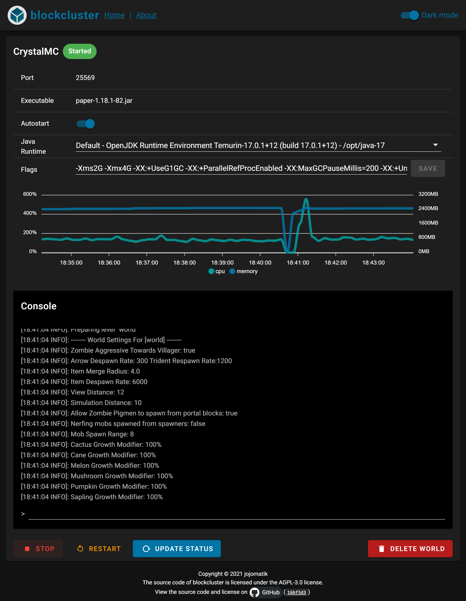

# blockcluster 
[](https://github.com/jojomatik/blockcluster/releases) [](LICENSE) [](https://github.com/jojomatik/blockcluster/actions/workflows/publish.yml) [](https://hub.docker.com/r/jojomatik/blockcluster) [](https://hub.docker.com/r/jojomatik/blockcluster)

An in-browser manager for your minecraft servers.



## Features
- Start and stop servers
- View current status
- Show resource usage
- View console log and send commands
- Select different java runtimes (See also: ["Adding custom java runtimes"](#adding-custom-java-runtimes))
- Change start flags
- Start servers with backend

## Roadmap for future releases
- Authentication
- Create servers and download server jars

## Setup 
### Setup with docker (recommended)
Prerequisites:
- Docker

Customize `/path/to/servers/on/host/machine` and the port directives `-p port:port` to your liking and run:
```sh
docker run -d -v /path/to/servers/on/host/machine:/usr/games/blockcluster/servers -p 8081:8081 25565-25569:25565-25569 jojomatik/blockcluster:latest
```
Open `http://[your ip]:8081` in your browser.

### Setup with `docker-compose` (also recommended)
Prerequisites:
- Docker
- Docker Compose

Download [`docker-compose.yml`](docker-compose.yml) and customize it to your liking and add a volume mount to your servers on the host machine. E.g.:
```
version: "3.9"
services:
  manager:
    ports:
      - 8081:8081
      - 25565:25565
    image: jojomatik/blockcluster
    volumes:
      - /path/to/servers/on/host/machine:/usr/games/blockcluster/servers
```

Then run the following command:
```sh
docker-compose up
```
Open `http://[your ip]:8081` in your browser.

### Manual setup 
Prerequisites:
- Git
- Node.js and npm
- TypeScript installed globally (`npm install -g typescript`)
- Java (to run the minecraft servers)

1. First build the app using the instructions from ["Building manually"](#building-manually).
2. Either
   - create the `servers/` subdirectory and move your servers into it or
   - set the environment variable `SERVER_PATH` to the relative or absolute path of your servers.
3. Run `npm run start` and open `http://[your ip]:8081` in your browser.

### Adding custom java runtimes
By default, the docker image based on [`docker-compose.yml`](docker-compose.yml) and the [`Dockerfile`](Dockerfile) includes java 11 and java 17. Those are the most relevant LTS java version for running minecraft servers (see [#150](https://github.com/jojomatik/blockcluster/issues/150) for more details).

#### Windows
All java runtimes in the `PATH` environment variable will be discovered and presented as an option in the frontend.

#### Docker
Mount additional java runtimes in the `/opt/java-xx` directory.

With the `docker run` command:
```sh
docker run -d -v /path/to/servers/on/host/machine:/usr/games/blockcluster/servers -v /path/to/java-xx/on/host/machine:/opt/java-xx -p 8081:8081 25565-25569:25565-25569 jojomatik/blockcluster:latest
```
or with `docker-compose`
```
version: "3.9"
services:
  manager:
    ports:
      - 8081:8081
      - 25565:25565
    image: jojomatik/blockcluster
    volumes:
      - /path/to/servers/on/host/machine:/usr/games/blockcluster/servers
      - /path/to/java-xx/on/host/machine:/opt/java-xx
```
```sh
docker-compose up
```

## Building
### Building with `docker-compose` (recommended)
Prerequisites:
- Git
- Docker
- Docker Compose

Run the following commands:
```sh
git clone https://github.com/jojomatik/blockcluster
cd blockcluster
```

**To build for production**, run the following command:
```sh
docker-compose up
```
Open `http://[your ip]:8081` in your browser.

**To enable hot reloads**, configure a file watcher for the TypeScript files in the `backend/src` directory to run `tsc` in the `backend` directory and run the following command:
```sh
docker-compose -f docker-compose.yml -f docker-compose.dev.yml up
```
Open `http://[your ip]:8081` in your browser.

To make sure that the container is recreated and the image rebuilt, use either command with additional options, e.g.:
```sh
docker-compose up --force-recreate --build
```

### Building manually
Prerequisites:
- Git
- Node.js and npm
- TypeScript installed globally (`npm install -g typescript`)
- Java (only to run the minecraft servers)

Run the following commands:
```sh
git clone https://github.com/jojomatik/blockcluster
cd blockcluster
npm install
cd backend && npm install
```

**To build for production**, run the following commands:
```sh
npm run build_all
npm run start
```
Open `http://[your ip]:8081` in your browser.


**To enable hot reloads**, configure a file watcher for the TypeScript files in the `backend/src` directory to run `tsc` in the `backend` directory and run the following command:
```sh
npm run serve
```
Open `http://[your ip]:8081` in your browser.

## Licensing
This project is licensed under the GNU Affero General Public License v3.0 (AGPL 3.0) or later. See also [`LICENSE`](LICENSE).
